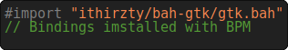
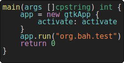
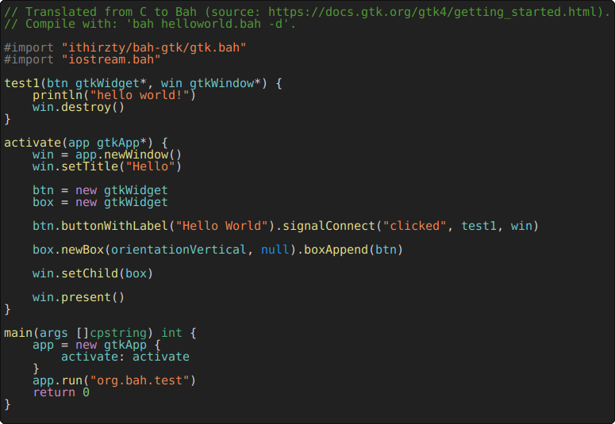
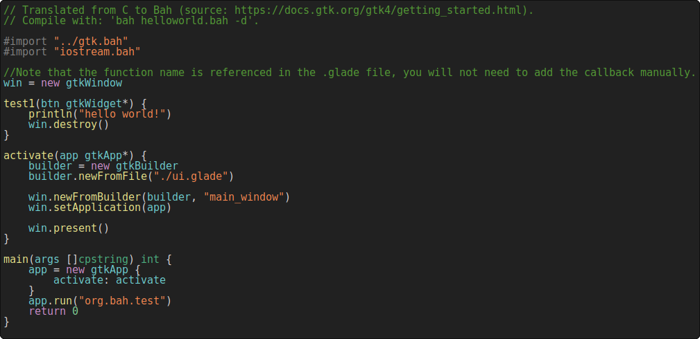

# bah-gtk
Here are some bindings for using GTK in Bah. These bindings are pretty basic, they are not finished.

## Getting started
The basics steps to get started building your GUI app.

## Installing the bindings
The easiest way to install the bindings is to use [BPM](https://github.com/ithirzty/bpm): `bpm -install ithirzty/bah-gtk`

> **Note** that gtk is a dynamic library, as such, you will need to compile your executables as dynamic using the `-d` option for the Bah compiler.

### Importing gtk
If you installed the bindings with BPM, simply import them like this:

### Creating a gtkApp
To create a gtkApp, you will need to declare it in your main function.
- The activate function is the function that will be called to create widgets,
- the name of the application can be specified as argument of `.run()`.

### Creating gtkWidgets
In your activate function, you will be able to create new gtkWidgets.

You can then chain method calls to set properties of your widgets.

### Using a gtkBuilder
If you want to design your gui in an editor (such as [glade](https://glade.gnome.org/)), you can use a gtkBuilder.
> All callback are automatically added to the builder upon creation.

## Examples
More examples are available in the [examples](./examples/) folder.